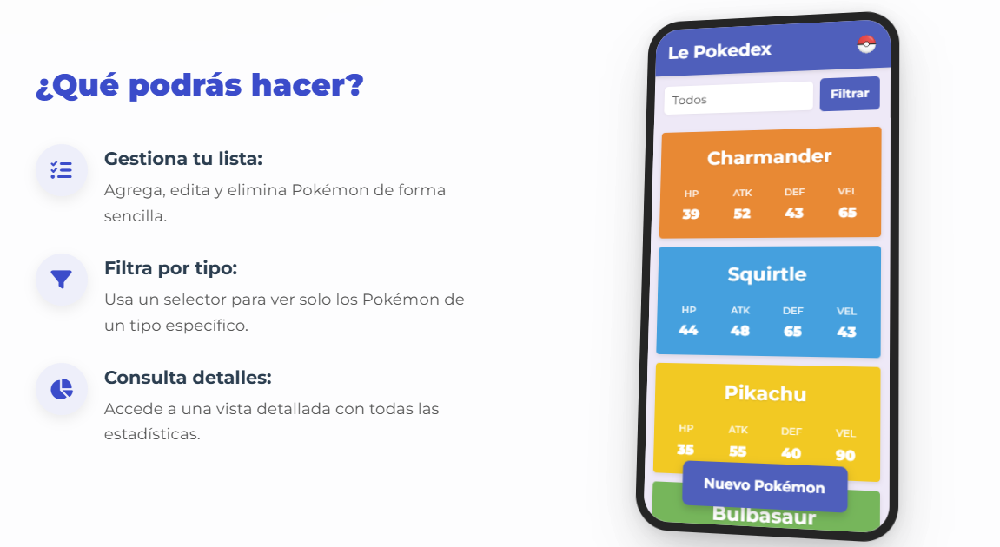
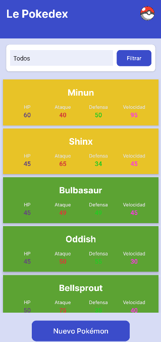
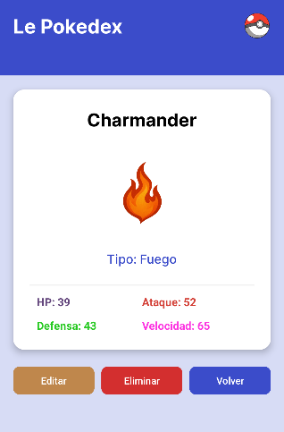
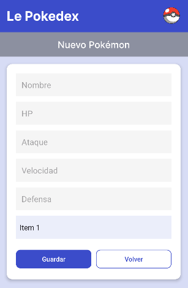

# 📱 Le Pokedex


**Le Pokedex** es una aplicación nativa de Android desarrollada en Java que permite gestionar tu propia colección de avistamientos Pokémon. Con una interfaz moderna basada en Material Design y tarjetas, ofrece una experiencia visual limpia y organizada, incluyendo estadísticas detalladas y clasificación por tipos elementales.

---

## 🌐 Web Oficial y Documentación

¡Ya está disponible la web oficial del proyecto! Puedes consultar la documentación extendida, novedades y más detalles en nuestro portal.

[](https://lepokedex.es)

👉 **Visita:** [lepokedex.es](https://lepokedex.es)

---

## 📲 Descarga y Releases

¿Quieres probar la aplicación? Descarga la última versión compilada (APK) directamente desde nuestra sección de Releases o visita la web.

> **🚀 Versión Actual:** v1.0.0 (Estable)

| [☁️ Descargar APK (GitHub Releases)](https://github.com/Josemajr6/LePokedex/releases) | [🌐 Descargar desde la Web](https://lepokedex.es) |
|:---:|:---:|

---

## 📸 Galería de la App

La interfaz ha sido renovada para ofrecer una experiencia de usuario fluida. Hemos implementado un diseño de tarjetas (`CardView`) con colores dinámicos que cambian según el tipo de Pokémon (Fuego, Agua, Planta, etc.).

| **Pantalla Principal** | **Detalle del Pokémon** | **Nuevo Registro** |
|:---:|:---:|:---:|
|  |  |  |
| *Listado con buscador y filtro* | *Stats y acciones rápidas* | *Formulario de alta* |

---

## 🚀 Características Principales

El proyecto implementa un sistema **CRUD Completo** (Create, Read, Update, Delete) con persistencia de datos local mediante SQLite:

* **🔍 Visualización y Filtrado:**
    * Lista interactiva con tarjetas personalizadas.
    * Indicadores visuales de tipos elementales.
    * **Filtrado dinámico:** Un `Spinner` en la pantalla principal permite filtrar la lista por tipo de Pokémon al instante.

* **📝 Gestión de Registros:**
    * **Crear:** Formulario validado para registrar nuevos Pokémon con sus estadísticas base (HP, Ataque, Defensa, Velocidad).
    * **Editar:** Posibilidad de modificar datos erróneos o actualizar estadísticas.
    * **Eliminar:** Borrado seguro de registros desde la vista de detalle.

* **🎨 UI/UX Moderna:**
    * Uso extensivo de `ConstraintLayout` para garantizar la adaptabilidad en diferentes tamaños de pantalla.
    * Estética limpia con bordes redondeados, sombras suaves y paleta de colores coherente.
    * Navegación intuitiva entre actividades.

---

## 🛠️ Tecnologías Utilizadas

Este proyecto sigue los estándares actuales de desarrollo nativo en Android:

* **Lenguaje:** Java 8+
* **IDE:** Android Studio (Koala / Ladybug)
* **Interfaz (UI):** XML (Layouts, Styles, Custom Drawables)
* **Persistencia:** SQLite (Gestión de base de datos interna sin dependencias de terceros)
* **Componentes Clave:**
    * `RecyclerView` / `ListView` (Manejo eficiente de listas)
    * `CardView` (Contenedores de información)
    * `FloatingActionButton` (Acciones principales)

---

## 🔧 Instalación para Desarrolladores

Si deseas contribuir al proyecto o modificar el código fuente:

1.  **Clonar el repositorio:**
    ```bash
    git clone [https://github.com/Josemajr6/LePokedex.git](https://github.com/Josemajr6/LePokedex.git)
    ```
2.  **Abrir en Android Studio:**
    * Ve a `File` > `Open` y selecciona la carpeta raíz del proyecto clonado.
3.  **Sincronizar y Ejecutar:**
    * Espera a que Gradle descargue las dependencias necesarias.
    * Selecciona un emulador (Pixel recomendado) o tu dispositivo físico y pulsa `Run`.

---

## ✒️ Autores

Este proyecto ha sido desarrollado con esfuerzo y dedicación por:

* **Juan José Gamero López** - [GitHub](https://github.com/juanjo210106)
* **Rafael Lázaro Díaz** - [GitHub](https://github.com/rafald10)
* **José Manuel Jiménez Rodríguez** - [GitHub](https://github.com/Josemajr6/)

---
<p align="center">
  Visita nuestra web oficial: <a href="https://lepokedex.es">lepokedex.es</a>
</p>